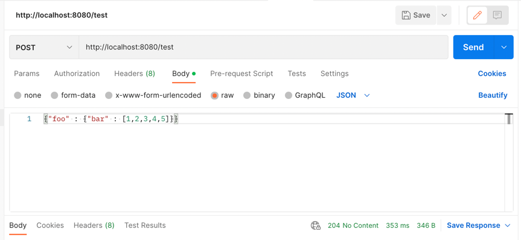

# Webhook-Proxy 
 It provides capability to transform input json message to required sink type format.
 Many type source service doesn't emit the message as for the actual webhook endpoint specification
 this proxy service can transform json message realtime and forword to right sink destination.
 
# Register endpoint
  Goto http://localhost:8080/index.html 
and register endpoint with transformation specification and destination
for complex transformation please referer below links
* [jslt home](https://github.com/schibsted/jslt)
* [jslt tutorial](https://github.com/schibsted/jslt/blob/master/tutorial.md)
* [jslt functions](https://github.com/schibsted/jslt/blob/master/functions.md)

# Example   

## Register endpoint 

  endpoint as `test`
  ```json 
  {
  "array" : .foo.bar,
  "size"  : size(.foo.bar)
  }
```

## Post at endpoint 



Post url http://localhost:8080/test
Input Message 
```json
{"foo" : {"bar" : [1,2,3,4,5]}}
```

Output message
```json
{
  "array" : [1,2,3,4,5],
  "size" : 5
}
```